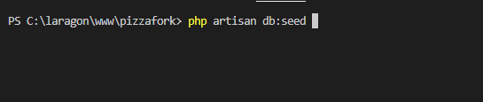
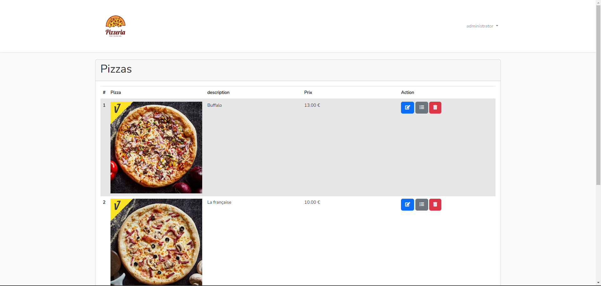

Le projet est en php8.1 et laravel 9, pour éviter toutes configurations il est préférable pour le moment d'utiliser le serveur web laragon.

Pour Laragon : https://github.com/leokhoa/laragon/releases/download/6.0.0/laragon-wamp.exe

Installer Composer : https://getcomposer.org/Composer-Setup.exe

Les extensions PHP requises :

Après avoir installé laragon nous faisons un simple git clone du projet  dans C:\laragon\www

## Configuration de l'environnement

étape 1 git clone dans C:\laragon\www

étape 2 composer update pour récupérer les différents dossiers/fichiers nécessaire.

étape 3 Créer la base de données php artisan migrate (laragon pas besoin de la créer préalablement).

Si un autre serveur web :

étape 4 renommer le fichier .env.example par .env

étape 5 configurer le fichier .env
 

étape 6 créer un  lien symbolique d'images --> commande php artisan storage:link 

étape 7 Remplir la base de données php artisan db:seed

Cela nous permet de créer l'utilisateur admin.

login de l'admin :

adresse mail : admin@outlook.fr

mot de passe : siojjr509

étape 8 générer une clé d'utilisation : php artisan key:generate

Il n'est pas nécessaire de faire ( php artisan serve).

## Diagramme de classe :

## <u>Cas d'utilisation Visiteur</u> :

## <u>Cas d'utilisation Client</u> :

## <u>Cas d'utilisation Admin</u> :

La page d'accueil du site :

Pour tester la pagination nous l'avons paramétrée à 2 pizzas par pages :

login de l'admin :

adresse mail : admin@outlook.fr

mot de passe : siojjr509

Connectons nous en tant qu 'administrateur :

la page principale du compte admin, Il a possibilités de d'ajouter, modifier, suppimer et consulter la garnitures des pizzas  :

Nous y reviendrons plus tard, consultons les ingrédients disponibles.

Nosu pouvons que pour le moment le seul ingrédient disponible est la pâte à pizza :

Ajoutons un nouvelle ingrédient en cliquant sur le bouton +.

Dans le formulaire de création nous saisissons son nom "fromage" et une photo :

L'ingrédient a bien été ajouté :

Modifions le en lui donnat le nom mozzarela :

Il a été modifié :

Rajoutons un nouvel ingrédient, il nous sera utile pour la suite (poivron) :

Sur la page principale du compte admin, nous cliquons sur l'icône grise pour consulter la garniture de la Buffalo :

Pour le moment la garniture de la buffalo n'a que la pâte à pizza :

Rajoutons un nouvel ingrédient à la garniture :

L'ingrédient a bien ajouté à sa garniture :

Déconnectons-nous :

Nous créeons un nouvel utilisateur du nom d'Adrien :

Après la validation de l'inscription, nous somme redirigée sur la page d'accueil :

Pour le moment notre panier est vide :

Rajoutons des pizzas au panier :

Nous prenons 2 Buffalo :

Nous avons un prix total de 40 €, commandons.

la commande a bien été reçu :

Cliquons sur mes commandes pour qu' Adrien consulte ses commandes :

Nous pouvons voir la commande précédente :

Nous cliquons sur ma commande et nous pouvons voir les pizzas de la commande :

Par gourmandise Adrien recommande 3 française :

la commande a été validée :

Les pizzas de la commande nous retrouvons les  3 française :

