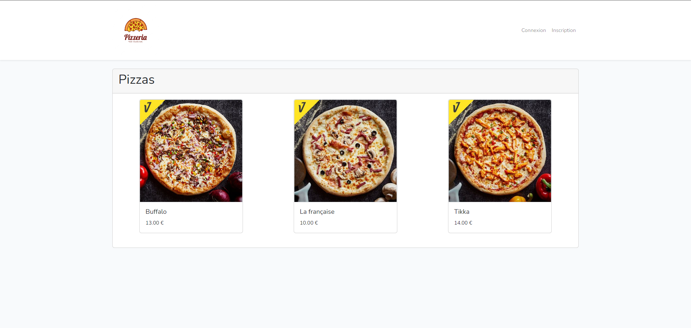
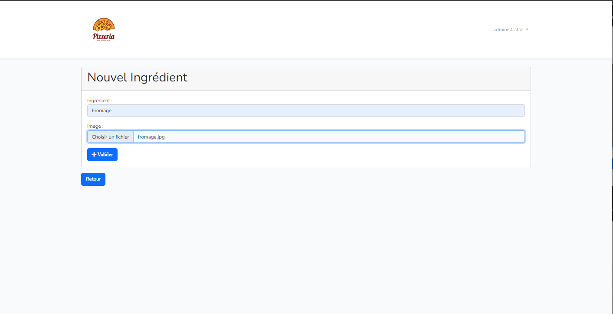
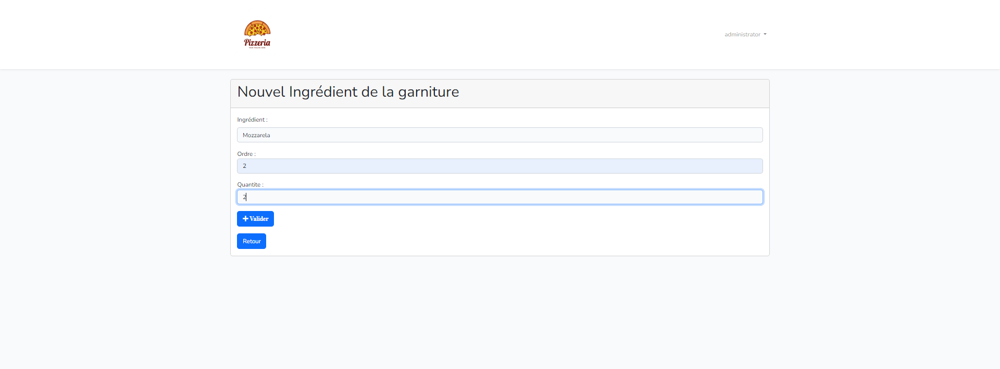

Le projet est en php8.1 et laravel 10, pour éviter toutes configurations il est préférable pour le moment d'utiliser le serveur web laragon.

Pour Laragon : https://github.com/leokhoa/laragon/releases/download/6.0.0/laragon-wamp.exe

Installer Composer : https://getcomposer.org/Composer-Setup.exe

Après avoir installé laragon nous faisons un simple git clone du projet  dans C:\laragon\www

## Configuration de l'environnement

étape 1 git clone dans C:\laragon\www

étape 2 composer update pour récupérer les différents dossiers/fichiers nécessaire.

étape 3 renommer le fichier .env.example par .env

étape 4 générer une clé d'utilisation : php artisan key:generate

étape 5 configurer le fichier .env

étape 6 faire un lien symbolique php artisan storage:link
 
étape 7 Créer la base de données php artisan migrate

étape 8 Remplir la base de données php artisan db:seed

étape 9 Nous pouvons nous rendre sur le site en vérifiant le nom domaine(virtualhost) que laragon nous à crée.

Il n'est pas nécessaire de faire lancer le serveur web de Laravel (artisan serve)

