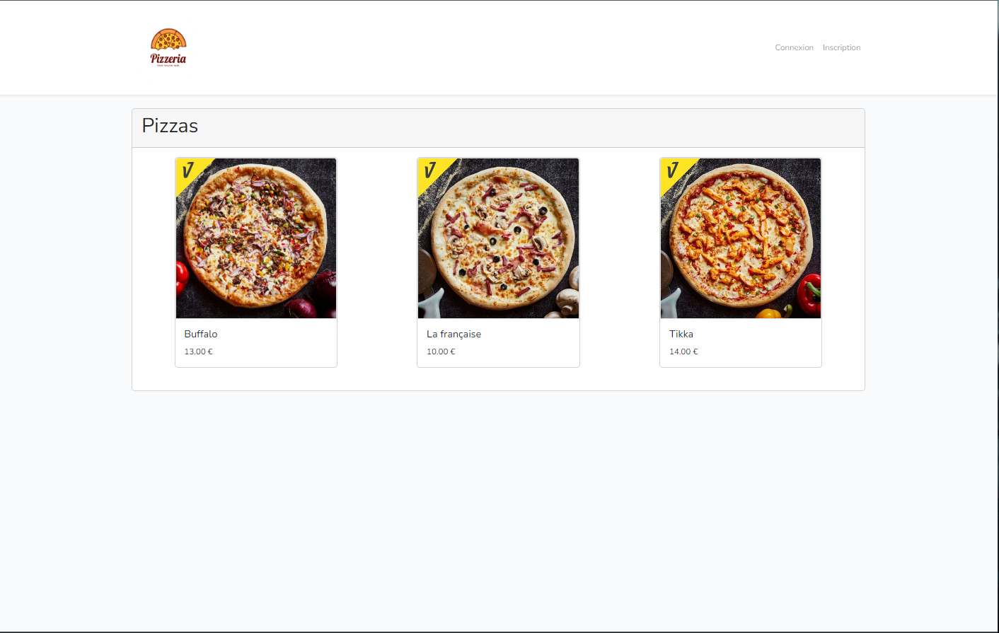
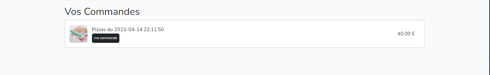

The project is using PHP 8.1 and Laravel 9. To avoid any complex configurations, it is recommended to use Laragon as the web server for now.

For Laragon : https://github.com/leokhoa/laragon/releases/download/6.0.0/laragon-wamp.exe

Install Composer : https://getcomposer.org/Composer-Setup.exe

Composer is a dependency manager for PHP, which is required to handle the PHP libraries and packages in the Laravel project.

Required PHP Extensions :

Please ensure that the following PHP extensions are enabled:

After installing Laragon, simply perform a git clone of the project into the C:\laragon\www directory.

## Environment Configuration

step 1 git clone dans C:\laragon\www

step 2 composer update To retrieve the necessary folders/files.

step 3 Create the database using php artisan migrate (with Laragon, there's no need to create it manually beforehand).

 If using another web server :

step 4 Rename the .env.example file to .env

step 5 To configure the .env file
 

step 6 To create a symbolic link for the storage directory --> command php artisan storage:link 

step 7 Fill the database using php artisan db:seed

This allows us to create the admin user.

Admin Login :

adresse mail : admin@outlook.fr

mot de passe : siojjr509

step 8  Generate an application key : php artisan key:generate

 It is not necessary to do ( php artisan serve).

##  Class Diagram :

## <u>Use Case Visiteur</u> :

## <u>Use Case Client</u> :

## <u>Use Case Admin</u> :

The homepage of the website :

To test the pagination, we have set it to 2 pizzas per page :

Admin Login :

email : admin@outlook.fr

password : siojjr509

 Let's log in as an administrator :

 On the main page of the admin account, they can add, edit, delete, and view pizza toppings :

We will come back to this later, let's check the available ingredients.

We can see that, for now, the only available ingredient is pizza dough :

Let's add a new ingredient by clicking the + button.

In the creation form, we enter the name "cheese" and upload a photo :

The ingredient has been successfully added :

Let's modify it by changing its name to mozzarella :

 
 It has been modified :

Let's add a new ingredient, it will be useful for the next steps (poivrons) :

On the main page of the admin account, we click on the gray icon to view the topping of the Buffalo pizza :

At the moment, the topping of the Buffalo pizza only consists of pizza dough :

Let's add a new ingredient to the topping :

The ingredient has been successfully added to its topping :

Let's log out :

We create a new user named Adrien :

After the registration is validated, we are redirected to the homepage :

For now, our cart is empty :

Let's add some pizzas to the cart :

We'll take 2 Buffalo :

We have a total price of 40€, let's place the order.

The order has been successfully received :

Click on 'My Orders' so Adrien can check his orders :

We can see the previous order :

We click on the order and we can see the pizzas in the order :

Out of greed, Adrien orders 3 French ones :

The order has been confirmed :

In the order, we find the 3 French ones :

An update has been made; we now have a chef who can view the customers' orders.

Le client Adrien a passé 3 commandes sur le site de pizzafork :

We create a new user, Enstso, who will order 3 pizzas :

His order :

Chef login :

chef@outlook.fr

siojjr509

I log in as a chef :

We can see Adrien's and Enstso's orders :

Enstso's order :

